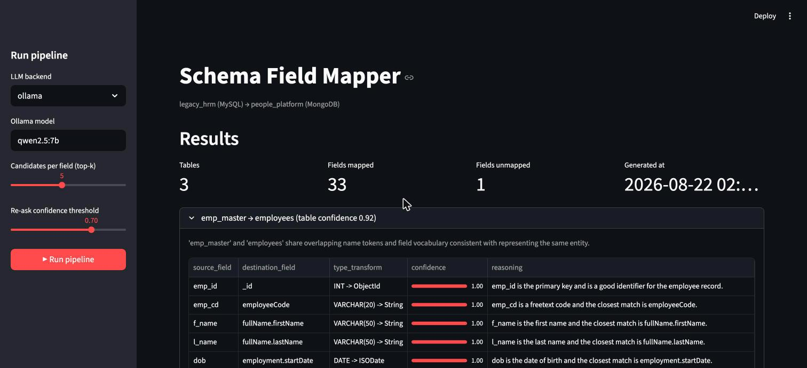
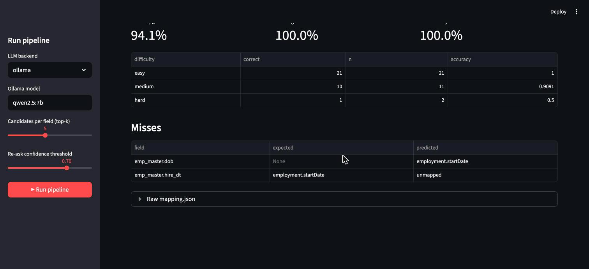
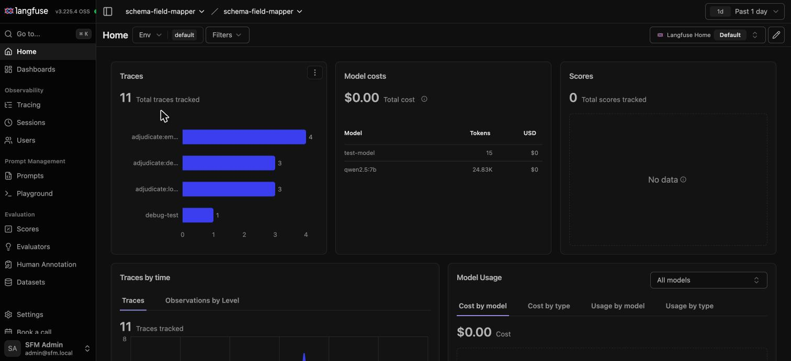
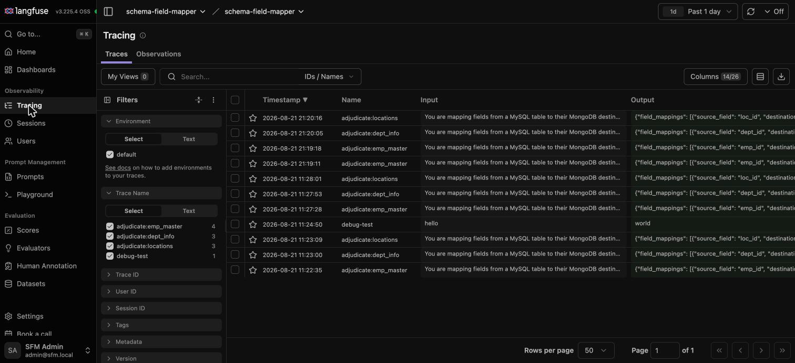
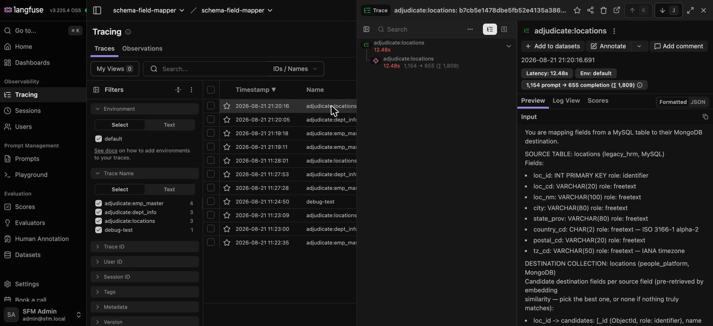
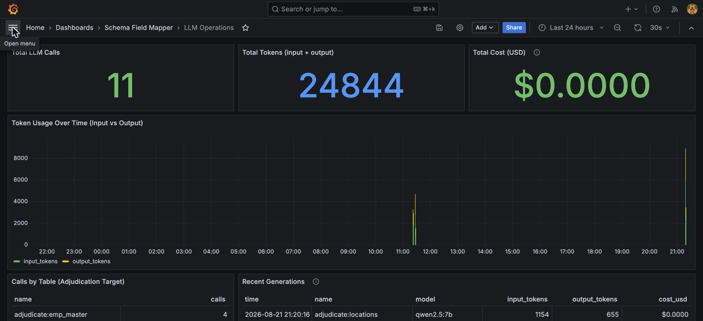
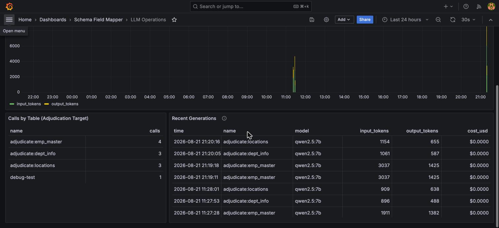
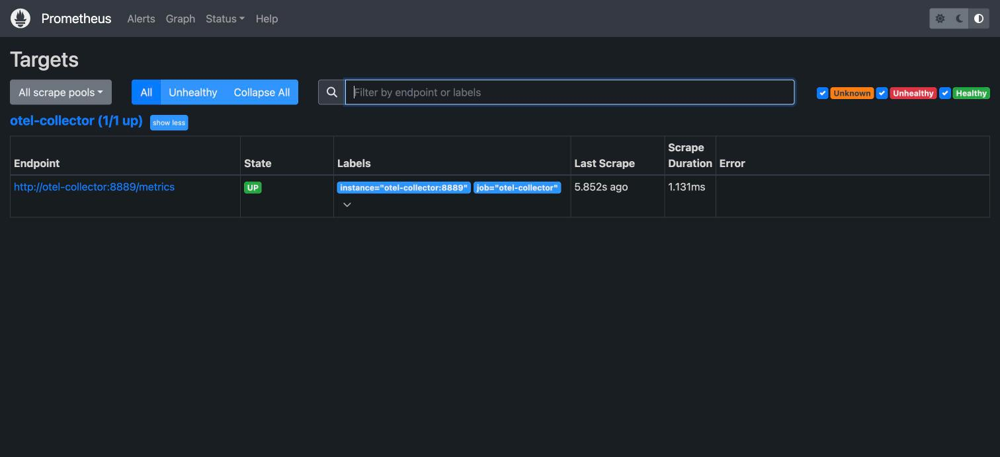

# Schema Field Mapper

AI pipeline that maps every field in the `legacy_hrm` MySQL schema to its
semantic equivalent in the `people_platform` MongoDB schema, and emits a
single JSON mapping document. Built for the IBM AI/LLM Engineer interview
assignment (`InterviewAssignment.docx`).

## Why this isn't one big prompt

The assignment's explicit constraint: *"You cannot pass both schemas to an
LLM in a single prompt and receive a finished mapping."* This pipeline
retrieves a short candidate list per source field with local embeddings
first, then asks Claude to adjudicate one source table at a time against
only its own candidates — never both full schemas in one call. Full
reasoning in `WRITEUP.md`.

## Quickstart

```bash
./scripts/start.sh   # venv + deps, MySQL/MongoDB, Grafana/Langfuse/Prometheus/Loki/Tempo/LiteLLM
./scripts/stop.sh    # stop everything (observability data is kept; MySQL/Mongo re-seed fresh next time)
```

Idempotent — re-run `start.sh` any time, already-running services are left
alone. It prints every URL when it's done. First run needs one manual step
(Langfuse doesn't have an API for "create my first project"): open
http://localhost:3001, sign up, create a project, and copy its keys into
`.env` — `start.sh`'s own output has the exact steps.

Everything below also works piece by piece if you'd rather not run the
full stack — `./scripts/start.sh` is the fast path, not the only path.

## UI

```bash
streamlit run app.py
```

A dashboard, not a second implementation — it imports `pipeline/` directly
and calls the same stages `run_pipeline.py` does. Watch the pipeline map
each table live from the sidebar (`▶ Run pipeline`), or just browse the
last `output/mapping.json`: per-table results with confidence bars,
unmapped-field warnings, and the gold-mapping eval scorecard, all in one
page instead of raw JSON + a separate `evaluate_mapping.py` call.



*Sidebar (left):* `▶ Run pipeline` triggers a live run against the
selected backend/knobs. *Results (right, per table):* every
`source_field → destination_field` pair from `pipeline/validate.py`'s
`TableMapping`, with `type_transform`, a `confidence` bar (0-1, from
Stage 4's LLM call, revised by Stage 7 if it fell below the re-ask
threshold), and `reasoning` — the LLM's one-sentence justification for
that specific mapping.



*Evaluation vs. gold mapping* (`pipeline/evaluate.py`, scrolled further
down the same page):

| Metric | Meaning |
| :-- | :-- |
| **Accuracy@1** | Fraction of the 34 gold-labeled fields whose top prediction matches the gold `expected` (or an accepted `alternatives` entry). The single headline correctness number. |
| **Coverage** | Fraction of gold fields the pipeline produced *any* verdict for (mapped or explicitly `unmapped`) — expected to be 100% by construction, since `validate_table_mapping`'s completeness check makes it a structural guarantee, not an empirical one. |
| **Path validity** | Fraction of emitted `destination_field` values that are real paths in `data/dest_schema.py` — catches a hallucinated destination before it reaches a real migration. |
| **by difficulty table** | Accuracy sliced by the `easy`/`medium`/`hard` label `data/gold_mapping.py` assigns each field — hard cases (like the `dob` no-match trap) are expected to score lower than easy ones. |
| **Misses** | Every field where the prediction didn't match gold: `field`, `expected`, `predicted` — the fastest way to see exactly what went wrong and why. |

## Setup

```bash
python3 -m venv .venv
source .venv/bin/activate
pip install -r requirements.txt
```

Requires Python 3.9+.

## Run

Two LLM backends for Stage 4/7 — pick whichever you have:

**No API key?** Run a local model via [Ollama](https://ollama.com):
```bash
ollama pull qwen2.5:7b   # or any model you already have
python run_pipeline.py --verbose --llm-backend ollama --ollama-model qwen2.5:7b
```
This is auto-selected by default when `ANTHROPIC_API_KEY` isn't set — `python run_pipeline.py --verbose` alone is enough if you've already got Ollama running.

**Have a Claude API key?**
```bash
cp .env.example .env   # fill in ANTHROPIC_API_KEY
python run_pipeline.py --verbose
```

Writes `output/mapping.json`. Flags:

- `--top-k` (default 5) — candidates retrieved per source field
- `--confidence-threshold` (default 0.7) — fields below this get a Stage 7 re-ask
- `--llm-backend {claude,ollama}` — defaults to claude if `ANTHROPIC_API_KEY` is set, else ollama
- `--ollama-model` (default `qwen2.5:7b`) — any locally-pulled Ollama model tag
- `--verbose` — per-table summary as it runs

## Real databases (Docker)

The assignment frames this as "two database schemas from separate
systems" — `docker-compose.yml` makes that literal: real MySQL
(`legacy_hrm`) and MongoDB (`people_platform`) containers, seeded from the
*same* schema data the pipeline reads (`scripts/generate_db_init.py`
generates the seed scripts from `data/source_schema.py` /
`data/dest_schema.py`, so they can't silently drift out of sync).

`./scripts/start.sh` brings these up too — the commands below are for
running just the databases, or building/running the pipeline's own
container image, on their own:

```bash
docker compose up -d mysql mongo   # start the two real databases
docker compose build pipeline      # build the pipeline image (bakes in the embedding model)
docker compose run --rm pipeline   # run it — reaches Ollama on the host via host.docker.internal
docker compose down -v             # stop and wipe the seeded data
```

Inspect what got seeded:

```bash
docker exec -it $(docker compose ps -q mysql) mysql -uroot -proot -e "USE legacy_hrm; SHOW TABLES; DESCRIBE emp_master;"
docker exec -it $(docker compose ps -q mongo) mongosh people_platform --eval "db.getCollectionNames()"
```

The MongoDB collections carry a real `$jsonSchema` validator reconstructed
from the flattened dot-paths back into their nested document shape — try
inserting a document with `isRemote: "not-a-bool"` and MongoDB itself
rejects it.

The pipeline still maps from `data/source_schema.py` / `data/dest_schema.py`
directly, not by introspecting the live containers — that's a separate,
larger feature (live schema introspection) this doesn't attempt.

With a Claude key instead of Ollama: `docker compose run --rm -e ANTHROPIC_API_KEY=$ANTHROPIC_API_KEY pipeline --llm-backend claude`.

## Test

```bash
pytest
```

The test suite is fully cold — no network calls, no `ANTHROPIC_API_KEY`
required, no model download. `tests/fakes.py` provides a deterministic
bag-of-words embedder and a fake LLM client that exercise the real pipeline
wiring (Stages 0-7) against fixed, inspectable logic.

Every function in `pipeline/` also has a docstring with a runnable
`Example:` (verified via `doctest`, not just written and hoped-for):

```bash
python -c "
import doctest, importlib
mods = ['pipeline.names', 'pipeline.lexicon', 'pipeline.roles', 'pipeline.parse_schema',
         'pipeline.align_tables', 'pipeline.embed_candidates', 'pipeline.llm_client',
         'pipeline.prompts', 'pipeline.map_fields', 'pipeline.validate', 'pipeline.reask',
         'pipeline.assemble', 'pipeline.evaluate', 'tests.fakes']
for name in mods:
    print(name, doctest.testmod(importlib.import_module(name)))
"
```

## Evaluate

```bash
python evaluate_mapping.py
```

Scores `output/mapping.json` against `data/gold_mapping.py` — a
hand-curated ground truth for all 34 source fields, written independently
of the pipeline so the check isn't circular. Reports `accuracy@1`,
`coverage`, `path_validity` (no hallucinated destination paths), sliced by
difficulty. See `WRITEUP.md` for a real result and the bug it caught.

## Production readiness (next phase)

Everything above is a working prototype. `docs/production/PROD-PLATFORM-CONFLUENCE.md`
is the architecture doc for running this as an enterprise service —
structured logging → Splunk, Prometheus/Grafana metrics, Langfuse-style
LLM observability (tokens, cost, prompt versioning), a FastAPI + Temporal
service layer, and the security/CI/FinOps tooling around it.
`docs/production/PROD-IMPLEMENTATION-BACKLOG.md` breaks that into 24
ticket-ready items across 6 dependency-ordered phases (~52 engineer-days),
each with acceptance criteria — start at Phase P0, `trace_id` propagation
is the one thing everything else compounds off of.

`deploy/observability/` has the local dev stack for Phase P0 (OTel
Collector, Prometheus, Grafana, Loki, Tempo, Langfuse, LiteLLM). **P0-5
(Langfuse tracing) is wired up and working** — real prompts, responses,
and token counts from actual pipeline runs. The rest (P0-1 through P0-3:
structured logging, OTel spans, the metrics catalogue) is still open.

### Start it

`./scripts/start.sh` (see Quickstart above) brings this up alongside the
app databases. To start only the observability stack:

```bash
cd deploy/observability
docker compose up -d
```

First boot takes a minute (ClickHouse/Postgres migrations). Then:

| Service | URL | Notes |
|---|---|---|
| Langfuse | http://localhost:3001 | Sign up, create a project, copy its API keys |
| Grafana | http://localhost:3000 | admin/admin, or anonymous (pre-configured) |
| Prometheus | http://localhost:9090 | Scraping the OTel Collector |
| MinIO console | http://localhost:9001 | minio/miniosecret |

Put the Langfuse keys in `.env` (see `.env.example`) — `run_pipeline.py`
auto-enables tracing when `LANGFUSE_PUBLIC_KEY` is set:

```bash
python run_pipeline.py --verbose   # now also traces to Langfuse
```

Open Langfuse → Tracing to watch each table's adjudication call — full
prompt, full response, real token counts, latency — as it happens.

### Dashboards

Screenshots below are from a real local run (Ollama backend, `qwen2.5:7b`) —
not mockups.

#### Langfuse (http://localhost:3001)



**Home** is the first thing you see per project:

| Panel | Meaning |
| :-- | :-- |
| **Traces** | One trace per LLM call this pipeline made (`LangfuseTracedLLMClient.map_fields` creates one generation per call — Stage 4's per-table adjudication, plus any Stage 7 re-asks). The bar chart breaks it down by trace name (`adjudicate:<table>`), so you can see call volume per source table at a glance. |
| **Model costs** | Summed `total_cost` across all generations, by model. `$0.00` for `qwen2.5:7b` is correct, not broken — Langfuse has no registered USD pricing for local Ollama models, only hosted APIs like Claude. |
| **Scores** | Human/automated quality scores attached to traces via Langfuse's `Evaluators`/`Human Annotation` — "No data" here because this pipeline doesn't push scores back to Langfuse; `pipeline/evaluate.py`'s accuracy/coverage/path_validity numbers (shown in the Streamlit evaluation scorecard above) are the equivalent signal, computed independently. |
| **Traces by time** | Call volume over the selected window (`Past 1 day` here) — a quick way to spot when a run happened and how long it took. |
| **Model Usage** | Token/cost breakdown by model, switchable between cost/usage and by-model/by-type views. |



**Tracing → Traces** is the full, filterable log: every call's timestamp,
name, raw `Input` (the exact prompt `pipeline/prompts.py` built) and
`Output` (the raw LLM response) side by side — useful for spotting a bad
prompt or a malformed response without re-running anything.



Clicking a trace opens the detail panel: **Latency** (wall-clock time for
that one call), **prompt → completion token counts** (`1,154 prompt → 655
completion` here, read from `ClaudeLLMClient`/`OllamaLLMClient`'s
`last_usage`), and the full formatted **Input**/Output — this is
`build_field_mapping_prompt`'s exact text, letters-for-letters what the
model saw, which is what makes a bad mapping debuggable instead of a
black box.

#### Grafana (http://localhost:3000 → Dashboards → Schema Field Mapper → LLM Operations)



This dashboard (`deploy/observability/grafana/dashboards/llm-operations.json`)
reads Langfuse's own ClickHouse store **directly**
(`grafana-clickhouse-datasource`, querying the `observations` table where
`type = 'GENERATION'`) — no separate app instrumentation, every traced
call shows up here automatically:

| Panel | Query (simplified) | Meaning |
| :-- | :-- | :-- |
| **Total LLM Calls** | `count()` generations | Every Stage 4/7 LLM call ever traced, all time. |
| **Total Tokens (input + output)** | `sum(input) + sum(output)` | Combined prompt + completion tokens across every call — the raw volume driving cost. |
| **Total Cost (USD)** | `sum(total_cost)` | Same `$0.00`-is-correct caveat as Langfuse Home above — no pricing model for local Ollama. |
| **Token Usage Over Time** | tokens grouped by minute | Two series (input vs. output) plotted over time — spikes line up with actual pipeline runs; a wide gap between input/output lines flags an unusually verbose or terse response. |



| Panel | Query (simplified) | Meaning |
| :-- | :-- | :-- |
| **Calls by Table (Adjudication Target)** | `count() GROUP BY name` | Call volume per `adjudicate:<table>` trace name — confirms every source table actually got adjudicated, and by how many calls (a re-ask shows up as a second call for the same table). |
| **Recent Generations** | latest rows, `time`, `name`, `model`, `input_tokens`, `output_tokens`, `cost_usd`, `latency_ms` | The most granular view — one row per call, most recent first. This is the fastest place to confirm "yes, the run I just triggered from Streamlit actually reached the LLM" without leaving Grafana. |



**Prometheus (http://localhost:9090)** is *not* where the LLM dashboards
live — it only scrapes the OTel Collector's own `/metrics` endpoint (shown
above: one target, `otel-collector:8889`, `UP`). That covers
infrastructure-style metrics (collector health, span/log throughput), not
LLM call data — Langfuse writes generation records straight to its own
ClickHouse store, which is why the LLM Operations dashboard queries
ClickHouse directly instead of going through Prometheus. Prometheus's own
UI is a raw PromQL query browser with no pre-built charts by design —
that's what Grafana is for.

## Pipeline stages

| Stage | Module | LLM call? |
| :-- | :-- | :-- |
| 0 — Parse & normalize | `pipeline/parse_schema.py` (roles from `pipeline/roles.py`) | no |
| 1 — Table/collection alignment | `pipeline/align_tables.py` | no — name/field-overlap heuristic, see `WRITEUP.md` |
| 3 — Candidate retrieval | `pipeline/embed_candidates.py` (name-overlap via `pipeline/lexicon.py`) | no — local sentence-transformers |
| 4 — Field adjudication | `pipeline/map_fields.py`, `pipeline/prompts.py`, `pipeline/llm_client.py` | yes, one call per source table |
| 5 — Validation, conflicts & completeness | `pipeline/validate.py` | no |
| 7 — Low-confidence re-ask | `pipeline/reask.py` | yes, only for fields below threshold |
| 6 — Assembly | `pipeline/assemble.py` | no |

Stage 2 (flattening destination fields to dot-paths) is done once, by hand,
directly in `data/dest_schema.py` rather than as runtime code — the
destination shape is static and small enough that a generic flattener
would be solving a problem this input doesn't have.

## Status

`output/mapping.json` in this repo was generated by an actual run of
`run_pipeline.py` against the local Ollama backend (`qwen2.5:7b`) — real
pipeline output, not hand-written. It currently scores 97.06% accuracy@1
against `data/gold_mapping.py` (`python evaluate_mapping.py`; 33/34, the
one miss being `dept_stat` — a genuinely hard lossy-enum case the pipeline
correctly declines to guess on rather than a wrong answer it's confident
about). Both LLM backends are pinned to `temperature=0`: two runs of the
same input now produce byte-identical output apart from `generated_at`.
See `WRITEUP.md` for the real bugs this build found and fixed along the
way (a duplicate-destination collision on `dob`/`created_ts`, and the
non-determinism itself). Re-run it yourself before submitting if you want
a fresh copy or want to try it against Claude.
